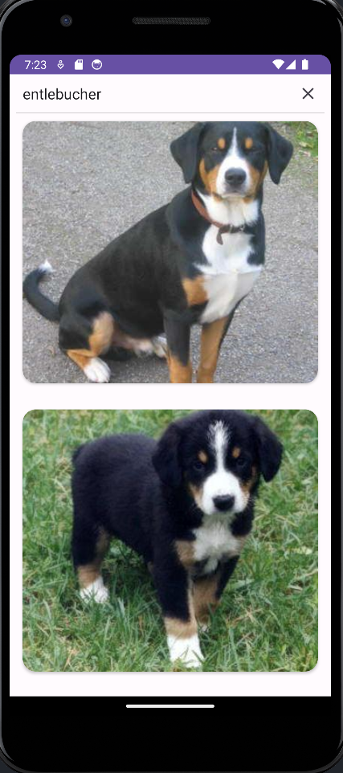

# Dog API Android App

Este proyecto de Android utiliza Retrofit en Kotlin para interactuar con la API de Dog API. La aplicación permite buscar imágenes de perros por raza y mostrarlas en un RecyclerView.

## Objetivo del Proyecto

El objetivo principal de este proyecto es demostrar cómo usar Retrofit para realizar solicitudes HTTP en una aplicación Android. En particular, se cubren las siguientes funcionalidades:

- Realizar una solicitud GET a la API de Dog API para obtener imágenes de perros por raza.
  [dogAPI](https://dog.ceo/dog-api/)
- Mostrar las imágenes obtenidas en un RecyclerView.
- Implementar un campo de búsqueda para buscar imágenes por raza.
- Manejar errores y mostrar un mensaje de error en caso de que la solicitud falle.
- Ocultar el teclado virtual después de realizar una búsqueda.

- 


## Configuración

Antes de ejecutar la aplicación, asegúrate de haber configurado adecuadamente tu proyecto Android y Retrofit con las dependencias necesarias.

### Dependencias

Asegúrate de que tu archivo `build.gradle` (Module: app) contenga las siguientes dependencias:


```gradle
dependencies {
    implementation "androidx.recyclerview:recyclerview:1.2.1"
    implementation "androidx.cardview:cardview:1.0.0"
    implementation "com.squareup.picasso:picasso:2.71828"
    implementation "com.squareup.retrofit2:retrofit:2.9.0"
    implementation "com.squareup.retrofit2:converter-gson:2.9.0"
}
```


### Retrofit

Crea una interfaz `APIService` para definir las solicitudes a la API de Dog API, como se muestra en el código a continuación:

```kotlin
interface APIService {
    @GET
    suspend fun getDogsByBreeds(@Url url: String): Response<DogResponse>
}
```
### MainActivity
La actividad principal (MainActivity) es la interfaz de usuario de la aplicación y contiene la lógica principal para realizar solicitudes y mostrar los resultados en un RecyclerView. Asegúrate de que tu actividad esté configurada adecuadamente, como se muestra en el código de ejemplo proporcionado.

### Uso
Ejecuta la aplicación en un dispositivo o emulador Android.
Ingrese el nombre de una raza de perro en el campo de búsqueda y presiona Enter o toca el ícono de búsqueda.
La aplicación realizará una solicitud a la API de Dog API y mostrará las imágenes de perros relacionadas con esa raza en el RecyclerView

